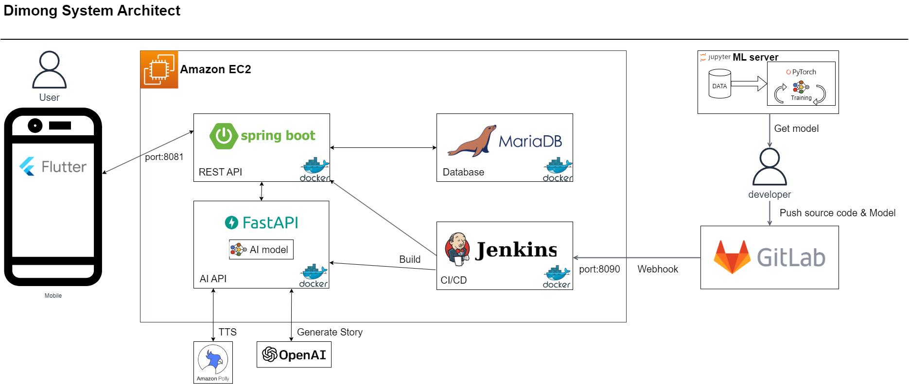

# README

# 디몽

디몽은 아동 지능 발달을 위한 공룡 학습 어플리케이션입니다.

## 목차

## 서비스 소개

디몽에선 아이들은 공룡에 대해 학습하고, 그림 그리기 활동을 할 수 있습니다.

공룡과 같은 특정 주제에 대한 학습과 그림 그리기 활동은 유아기, 아동기 지능 발달에 도움이 됩니다.

공룡은 아주 먼 옛날에 살았던 크기가 큰 환상적인 존재로 아이들의 상상력을 자극하고, 강한 흥미를 유발합니다. 유아기, 아동기의 아이들이 강한 흥미를 가진 주제에 대해서 학습할 때 지적능력은 많이 향상될 수 있습니다. 정보를 처리하는 과정을 통해 복합적 사고 능력을 훈련함으로써 지능 발달에 도움이 됩니다. 어려운 공룡 이름은 아이들의 언어 발달에도 도움이됩니다.

그림 그리기 활동은 아이들의 운동 능력과 정신적인 기술을 발전 시킵니다. 그림을 그리면 아이들은 뇌의 이성적인 좌뇌와 감정적이고 창조적인 특성을 가진 우뇌를 모두 강화할 수 있습니다. 그림 그리기는 아이들의 집중력과 인내심을 장려합니다. 아이디어와 그 주위에 있는 것에 대한 인식을 정리하는 데 도움을 주는 것입니다. 아이들은 주로 자시들이 알고 있는 것에 대해 그림을 그리는데 이 과정은 아이들의 관찰력을 자극합니다. 그리고 뇌는 종이에 현실을 추상화하려고 더 열심히 노력하면서 시각적 인식과 추상적 사고의 발달이 이뤄집니다.

## 기술 스택

| FE | BE | AI | infra,CI/CD|
| :---:        |    :----:   |          :---: | :---: |
|       |        |    |  |
| |         |       |  |
| |  | | |
  

## 서비스 아키텍처

## 팀원 소개

|강효진|김소현|김영식|안태윤|양희진|이경진|
| :---: | :----: | :---: | :---: | :---: | :---: |
|BE|FE|AI |AI |FE |FE |
