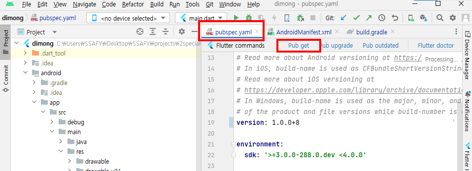
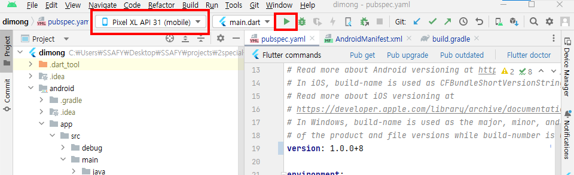

# 프론트엔드 포팅 메뉴얼

- [프론트엔드 포팅 메뉴얼](#프론트엔드-포팅-메뉴얼)
  - [소스 파일 설명](#소스-파일-설명)
    - [Project Structure](#project-structure)
  - [FE](#fe)
    - [1.Flutter SDK 설치](#1flutter-sdk-설치)
    - [2. Android 개발 환경 설정](#2-android-개발-환경-설정)
    - [3. Android studio에서 빌드하기](#3-android-studio에서-빌드하기)
- [](#)

## 소스 파일 설명

### Project Structure
``` bash
dimong/
├─ FE/
│ ├─ dimong
├─ BE/
│ ├─ dimong_BE
└─ AI model/
```

<aside>
📁 dimong/BE/dimong_BE

</aside>

REST API용 SpringBoot 프로젝트 root path 입니다

<aside>
📁 dimong/FE/dimong

</aside>

Flutter app project root path 입니다.

<aside>
📁 dimong/AI model

</aside>

Image inference, TTS 모델 관련 코드입니다.

## FE

### 1.Flutter SDK 설치

* 버전 정보 : Flutter 3.9.0-20.0.pre.13 • channel master
1. 원하는 위치에 다음 명령어 실행으로 flutter sdk 다운로드
   
   예제에서는 'C:\src\' 에 설치한다.
   
   ```
   git clone https://github.com/flutter/flutter.git -b master
   ```

2. Windows 환경 변수 설정
   
   1. 윈도우 + s 로 검색창 열어 '시스템 환경 변수 편집' 검색
   
   2. 시스템 속성 창의 고급 탭
      
      1. 환경 변수(N)...클릭
      
      2. 사용자 변수 Path 선택 후 편집 클릭
         
         1. 새로만들기 클릭 후 flutter 설치한 위치 입력
            
            1. C:\src\flutter\bin
      
      3. 사용자 변수에 Path에 없을 때 
         
         1. 새로만들기 클릭
         
         2. 변수 이름 : Path , 
            변수값: flutter 설치한 위치(예제에서는 C:\src\flutter\bin )

3. 설치 확인
   
   다음 명령어로 설치됐는지 확인한다.
   
   flutter 를 부팅한다.
   
   ```
   flutter doctor
   ```

### 2. Android 개발 환경 설정

[윈도우에서 설치 - Flutter](https://flutter-ko.dev/docs/get-started/install/windows)참고하여 안드로이드 설정을 완료한다.

* android studio 설치

* android studio 내 flutter 플러그인 설치

### 3. Android studio에서 빌드하기

* flutter project 열기
  
  * 주의: android 프로젝트(<root>\FE\dimong\android)가 아니라 flutter project(\FE\dimong)를 열어야 함

* 설정값 수정
  
  1. API 요청 URL 설정
     
     안드로이드 에뮬레이터에서 'http://10.0.2.2'는'http://localhost'와 같다.
     
     로컬 환경에서 테스트할 때 port를 맞춰준다.
     
     파일 위치 : /FE/dimong/lib/core/api/api.dart
     
     ```
     class DataServerDio {
       static Dio instance() {
         final dio = Dio();
     ...
         // Set the base URL for Server 1
         // dio.options.baseUrl = 'http://10.0.2.2:5000/';
     ...
       }
     }
     ```

* pubspec.yaml 열기
  
  * Pub get 클릭
    
    

* 기기 선택 후 Run 클릭
  
    

# 
